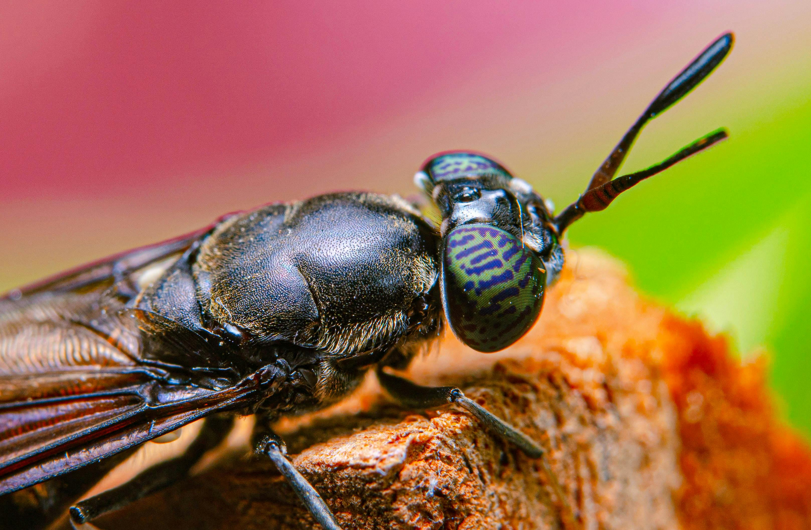

::: {.course-meta-block .quarto-title-meta}
:::: {.quarto-title-meta-heading}
Seminar date:
::::
:::: {.quarto-title-meta-contents}
 
::::
:::

We invite you to a seminar with Assistant Professor Grum Gebreyesus from Aarhus University, Denmark, on phenomics in insect breeding.

In his talk, “Innovative phenotyping systems to advance selective breeding in black soldier fly,” he will discuss the development and application of phenotyping approaches to support data-driven selection in black soldier fly. 

We will see how robust, scalable phenotypic data can strengthen breeding programs and advance emerging insect production systems.

Welcome to this exciting online seminar!

 

[{.class width=60%}]()

Picture thanks to [Oktavianus Mulyadi](https://www.pexels.com/photo/extremely-magnification-close-up-face-of-a-black-soldier-fly-meet-the-fly-that-could-help-save-the-planet-14591396/). 