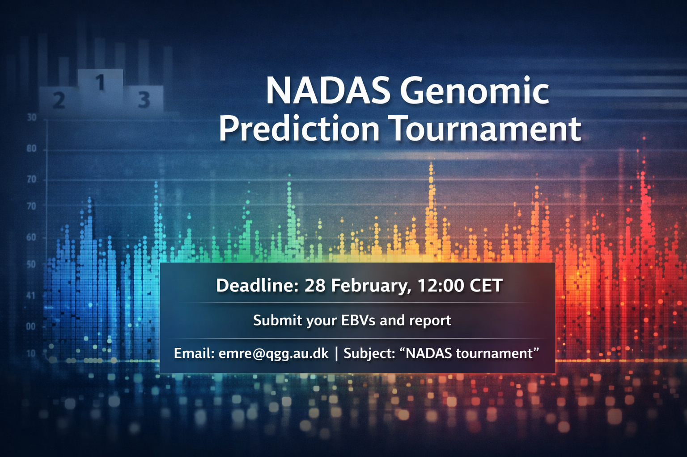

::: {.course-meta-block .quarto-title-meta}
:::: {.quarto-title-meta-heading}
Tournament dates:
::::
:::: {.quarto-title-meta-contents}
 to 
::::
:::

Are you ready to test your genomic prediction skills? The NADAS network invites you to participate in the NADAS Genomic Prediction Tournament — a hands-on challenge built around simulated phenotypic, genotypic, and functional annotation data. Whether you favor classical BLUP-based approaches or more advanced machine learning strategies, this is an opportunity to put your method to the test.

The full dataset is available on [figshare](https://figshare.com/articles/dataset/Data_sets_for_genomic_prediction_tournament_within_NADAS_network/31368754).

## Your task

...is straightforward: use the provided data to perform genomic prediction for reference and test individuals, and report estimated breeding values (EBVs) in an Excel or text file. The choice of prediction method is up to you. Innovation and methodological rigor are both welcome. 

Please note that this is an individual competition — no group submissions.

**Deadline: 28 February at 12:00 CET.**

## What’s in the data?

The reference phenotype file (refPheno) contains **phenotypes for 1,050 individuals** (trait heritability = 0.4). 
Corresponding genotype files are provided for 1,050 reference individuals (refNoQTL) and 1,050 test individuals (testNoQTL). These files include marker genotypes only — QTL have been excluded — and individual order is consistent across files.

In addition, AnnotNoQTL provides **functional annotation information** for 12,354 markers across five chromosomes. 
The first column indicates chromosome, and columns 2–4 flag markers belonging to specific annotation categories. Marker order matches the genotype files, enabling seamless integration into your prediction pipeline.

## How to participate

Submit:

- A maximum one-page report describing your methodology and explaining your choice of approach.
- An Excel or text file containing the EBVs (attached to your email).

Send your submission to emre@qgg.au.dk
with the subject line: “NADAS tournament”.

If you have questions about the data or practical details, feel free to get in touch. We look forward to seeing the range of predictive strategies — and the performance they achieve.

 

[{.class width=60%}]()

Image generated with ChatGPT
